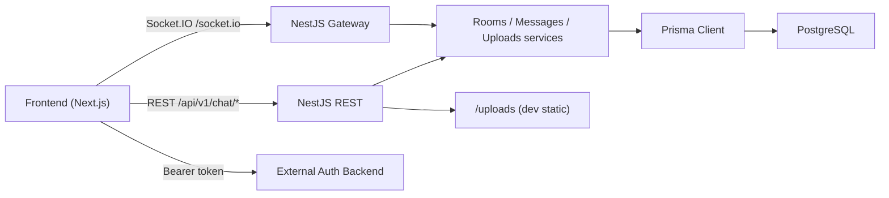
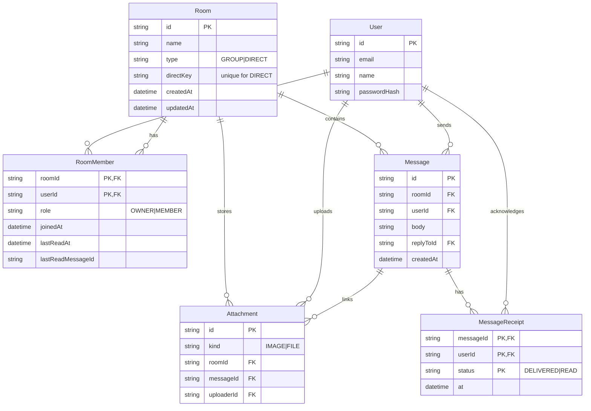
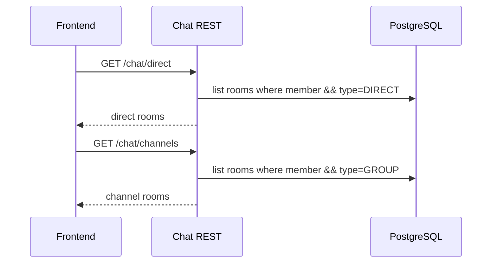
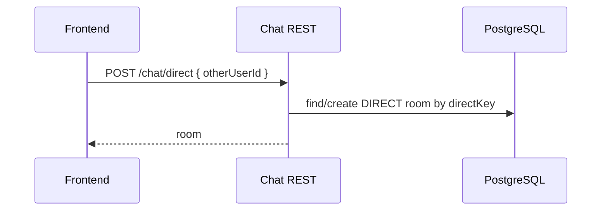
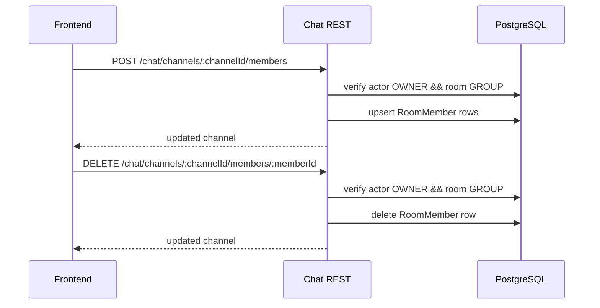

# Selam Collaboration Chat Backend

Real-time chat backend built with NestJS, Prisma, PostgreSQL, and Socket.IO.

This backend is now **chat-only**:
- no local login/register endpoints
- identity comes from an external auth system via `Authorization: Bearer <token>`
- chat features are separated into **Channels** and **Private (Direct) chats**

---

## What changed (latest)

- Added explicit API separation:
  - **Channels**: group management and membership CRUD
  - **Direct**: private one-to-one conversations
- Channel membership management is restricted to group channels only.
- Swagger now exposes dedicated `chat-channels` and `chat-direct` routes.
- Legacy `/chat/rooms/*` routes are still available for backward compatibility, but are hidden from Swagger.

---

## Architecture overview



---

## Updated data model and table relationships

Current schema already supports the latest behavior; no new migration is required for the recent channel/direct split.

Core entities:
- `User`: chat participant identity (mirrored/provisioned from token claims)
- `Room` (internal table): conversation container (`GROUP` or `DIRECT`)
- `RoomMember`: membership and role (`OWNER` / `MEMBER`)
- `Message`: message body, sender, optional reply
- `MessageReceipt`: delivery/read tracking
- `Attachment`: file/image metadata



### Channel vs Direct rules

- `Room.type = GROUP` (API name: **Channel**):
  - can rename/delete channel (owner only)
  - can add/remove members (owner only)
  - members can leave
- `Room.type = DIRECT` (API name: **Direct chat**):
  - only participants can view/send
  - no add/remove member operations
  - one unique room per user pair via `directKey`

> Clarification: in database and internal service code we still use the word `Room` as the technical conversation table.
> In API and Swagger, use **Channel** for groups and **Direct** for private chats.

---

## How components communicate

### 1) Open chat list


### 2) Start private chat


### 3) Channel member management


### 4) Real-time messaging
- REST is used for listing and uploads.
- Socket.IO handles live events (`chat:join`, `chat:send`, `chat:typing`, receipts).

---

## API groups (preferred routes)

Base prefix: `/api/v1`

### Channels (`chat-channels`)
- `GET /chat/channels`
- `POST /chat/channels`
- `POST /chat/channels/:channelId/join`
- `PATCH /chat/channels/:channelId`
- `DELETE /chat/channels/:channelId`
- `POST /chat/channels/:channelId/members`
- `DELETE /chat/channels/:channelId/members/:memberId`
- `POST /chat/channels/:channelId/leave`
- `GET /chat/channels/:channelId/messages`
- `POST /chat/channels/:channelId/messages`
- `POST /chat/channels/:channelId/typing`
- `POST /chat/channels/:channelId/receipts/delivered`
- `POST /chat/channels/:channelId/receipts/read`
- `POST /chat/channels/:channelId/read`
- `POST /chat/channels/:channelId/uploads`

### Direct (`chat-direct`)
- `GET /chat/direct`
- `POST /chat/direct`
- `POST /chat/direct/:directId/access`
- `GET /chat/direct/:directId/messages`
- `POST /chat/direct/:directId/messages`
- `POST /chat/direct/:directId/typing`
- `POST /chat/direct/:directId/receipts/delivered`
- `POST /chat/direct/:directId/receipts/read`
- `POST /chat/direct/:directId/read`
- `POST /chat/direct/:directId/uploads`
- `GET /chat/users` (directory for starting direct chats)

### Backward-compatible legacy routes
- `GET /chat/rooms`
- `POST /chat/rooms`
- `PATCH /chat/rooms/:roomId`
- `DELETE /chat/rooms/:roomId`
- `POST /chat/rooms/:roomId/members`
- `DELETE /chat/rooms/:roomId/members/:memberId`
- `POST /chat/rooms/:roomId/leave`
- `POST /chat/dm`

---

## Swagger

- Local: `http://localhost:4000/api/docs`
- JSON: `http://localhost:4000/api/docs-json`
- Ngrok: `https://<your-ngrok-domain>/api/docs`

Swagger tags now include:
- `chat-channels`
- `chat-direct`
- `chat-messages`
- `chat-uploads`

---

## Local development

```bash
cd backend
npm install
cp .env.example .env
npm run prisma:migrate
npm run dev
```

Defaults:
- REST: `http://localhost:4000/api/v1`
- Swagger: `http://localhost:4000/api/docs`
- Socket.IO: `http://localhost:4000/socket.io`

---

## Environment variables (important)

- `DATABASE_URL`: PostgreSQL connection
- `PORT`: default `4000`
- `API_PREFIX`: default `api/v1`
- `FRONTEND_URL`: CORS origins (comma-separated)
- `JWT_SECRET`: required by app bootstrap
- `REQUIRE_JWT_VERIFY`:
  - `true`: verify JWT signature
  - `false`: decode claims without signature verification (dev/interoperability mode)

---

## Ngrok usage

```bash
cd backend
npm run ngrok
```

This exposes backend routes and Swagger through one public URL, for example:
- `https://<subdomain>.ngrok-free.dev/api/v1/...`
- `https://<subdomain>.ngrok-free.dev/api/docs`

Frontend should point to:
- `NEXT_PUBLIC_API_BASE_URL=https://<subdomain>.ngrok-free.dev/api/v1`
- `NEXT_PUBLIC_WS_URL=https://<subdomain>.ngrok-free.dev`

